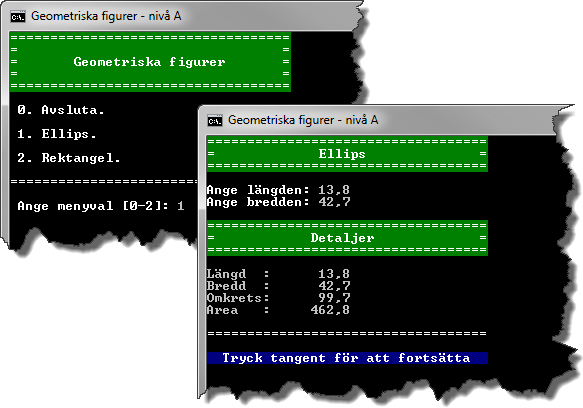

2.3 Geometriska figurer (A-, B-, och C-nivå)
============================================
[2-3-geometriska-figurer.pdf](https://github.com/1dv402/kursmaterial/raw/master/Laborationsuppgifter/2-3-geometriska-figurer.pdf)

"Geometriska figurer har flera egenskaper, som area och omkrets, som kan vara intressant att beräkna. Gemensamt för en ellips och rektangel är att de kan beskrivas med hjälp av längd och bredd. Med utgångspunkt från längden och bredden kan area och omkrets beräknas för respektive figur.

Du ska skriva en applikation som med hjälp av klasser grupperar beräkningarna av olika figurers area och omkrets. Beräkningar rörande en ellips area och omkrets ska placeras i klassen `Ellipse`. I klassen `Rectangle` ska beräkningar rörande en rektangels area och omkrets placeras.

Via en meny ska typ av figur väljas för vilken beräkning av area och omkrets ska göras. Efter att figur valts ska figurens längd och bredd anges varefter figurens detaljer ska presenteras."

